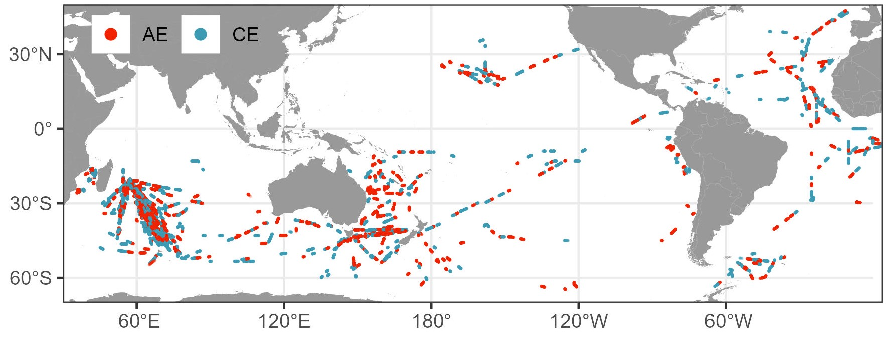
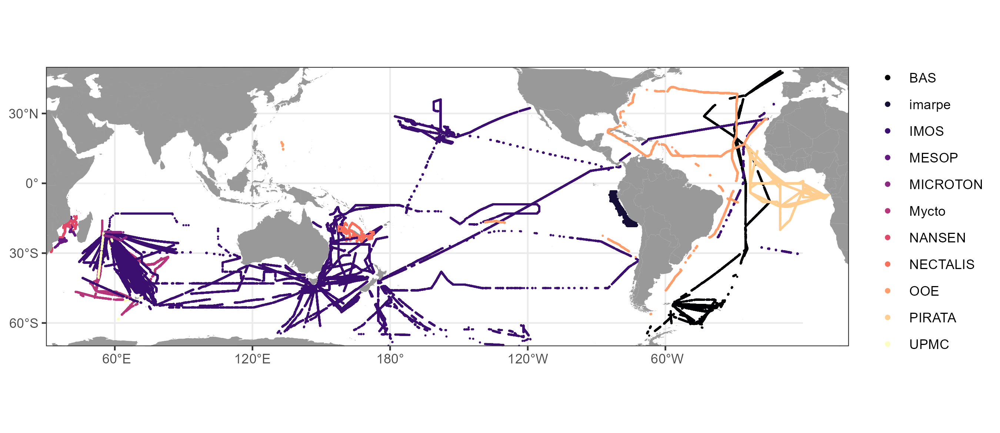

# Global atlas of mesoscale eddies and impact of forage fauna

<!-- badges: start -->

<!-- badges: end -->

<!-- doi: start -->

<!-- doi: end -->

## Overview

This project is dedicated to study the impact of mesoscale eddies on forage fauna at global scale. This GitHub repository provides the code of the Receveur et al. (2024) publication in Nature Communication. In this sutdy, we sample 1000 eddies spread in four ocean with active acoustic. 

## Data sources

This project uses the following acoustic databases:

| Creator         | Repository                                    | Program                   | Area   | References  |
| :-------------- | :------------------------------------------- | :------------------------ | :----:  | :----: |
| CSIRO, Australia|AODN|  IMOS SOOP-BA| South Indian | Haris, K. et al. Sounding out life in the deep using acoustic data from ships of opportunity. Sci. Data 8, 23 (2021).|
| IRD, France     |SEANOE|NANSEM| Mozambique channel  | 	SEANOE. Sea Open Scientific Data Publication. (2021).|
| IRD, France     | SEANOE |  MICROTON | Mozambique channel|  	SEANOE. Sea Open Scientific Data Publication. (2021).|
|  IRD, France  | SEANOE| MESOP  |Mozambique channel |	SEANOE. Sea Open Scientific Data Publication. (2021). |
|  IRD, France      | SEANOE     | PIRATA | Eastern tropical Atlantic| 	SEANOE. Sea Open Scientific Data Publication. (2021).|
| BAS, United Kingdom   |BODC|AMT, WCB  | Atlantic|British Antarctic Survey - Natural Environment Research Council. Water column acoustic data collected in the Atlantic Ocean between 2006 and 2017. (2017). |
| IMARPE, Peru     |PANGAEA      | Survey 0110-11 |Peruvian Humboldt Current System | IMARPE. Crucero de evaluación hidroacústica de recursos pelágicos BICs Humboldt, Olaya, SNP-2 y LP IMARPE IV 0110-11. (2004). |
| UPMC, France  |MESOPP | Themisto |South Indian | MESOPP. Mesopelagic Southern Ocean Prey and Predators.|
| CSIC, Spain | PANGAEA | Malaspina | Circumnavigation 40°N-40°S |  Irigoien, X. et al. The Simrad EK60 echosounder dataset from the Malaspina circumnavigation. Sci. Data 8, 259 (2021).|
| Institute of Marine Research | IMR | One Ocean Expedition | Global | [link](https://ftp.nmdc.no/nmdc/IMR/OneOcean) |

The global atlas of eddy trajectories is available here [link](https://www.aviso.altimetry.fr/en/data/products/value-added-products/global-mesoscale-eddy-trajectory-product/meta3-2-dt.html).

## Workflow

The analysis pipeline follows these steps:

1. Download eddy data
2. Download acoustic data
3. Overlap the two data sources to only keep acoustic data inside and around eddies 
4. Make and Export the Figures 1 and 2
5. Compare inside acoustic values to outside acoustic values in each eddy 
6. Make and Export the Figures 3 and 4
7. Compare the spatial distribution of the results with the previously published results

## Content

This repository is structured as follow:

- [`data/`](https://github.com/auroreRECE/eddy_micronecton/tree/main/data): contains a sampled of data used in the article. The folder is split in two folders: [`data/raw/`](https://github.com/auroreRECE/eddy_micronecton/tree/main/data/raw) to find a sample of all raw data (acoustic, eddy trajectories, chloro and sst) ; and [`data/intermediate/`](https://github.com/auroreRECE/eddy_micronecton/tree/main/data/intermediate) with some intermediate .Rdata files, to make easily the Figures. 

- [`figures/`](https://github.com/auroreRECE/eddy_micronecton/tree/main/figures): contains the figures used to validate et visualize the outputs.

- [`scripts/`](https://github.com/auroreRECE/eddy_micronecton/tree/main/scripts): contains R scripts to run the workflow. The order to run these scripts is explained in each name of files and follow the Workflow description.

## Citation

Please use the following citation: 

> Receveur A, Menkes C, Lengaigne M, Ariza A,  Bertrand A, Dutheil C, Cravatte S, Allain A, Barbin L, Lebourges-Dhaussy A, Lehodey P,  Nicol S. (2024) Code for "A rare oasis effect for forage fauna in oceanic eddies at the global scale." URL: <https://github.com/auroreRECE/eddy_micronecton/tree/main/>.

## Contributing

All types of contributions are encouraged and valued. 

## Acknowledgments

We acknowledge the Australian Integrated Marine Observing System (IMOS), the French National Research Institute for Sustainable Development (IRD), the British Antarctic Survey (BAS), the Peruvian Marine Institute (IMARPE), the Pierre and Marie Curie University (UPMC) and the Spanish National Research Council (CSIC) for their generous and invaluable contributions to the public acoustic databases used in the present study. We acknowledge Geir Pedersen for his help, and the cruise member of the One Ocean Expedition. 

Aurore Receveur is part of the MAESTRO group co-funded by the Centre for the Synthesis and Analysis of Biodiversity (CESAB) of the Foundation for Research on Biodiversity (FRB), and by France Filière Pêche. 

